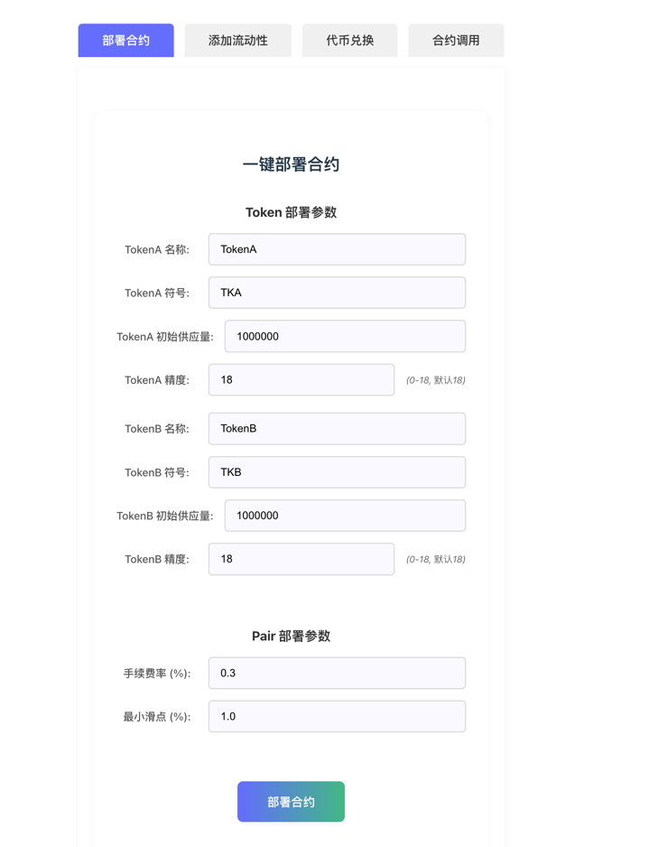
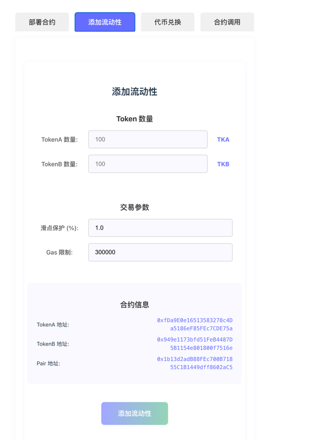
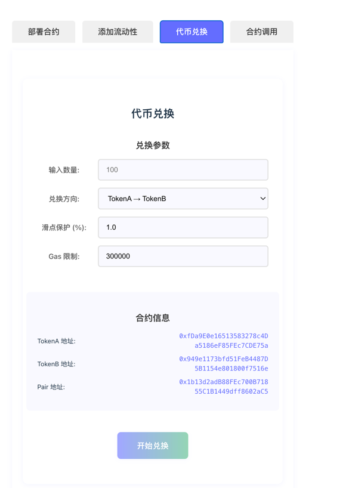
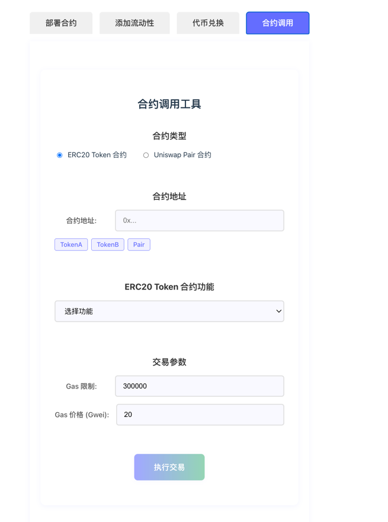
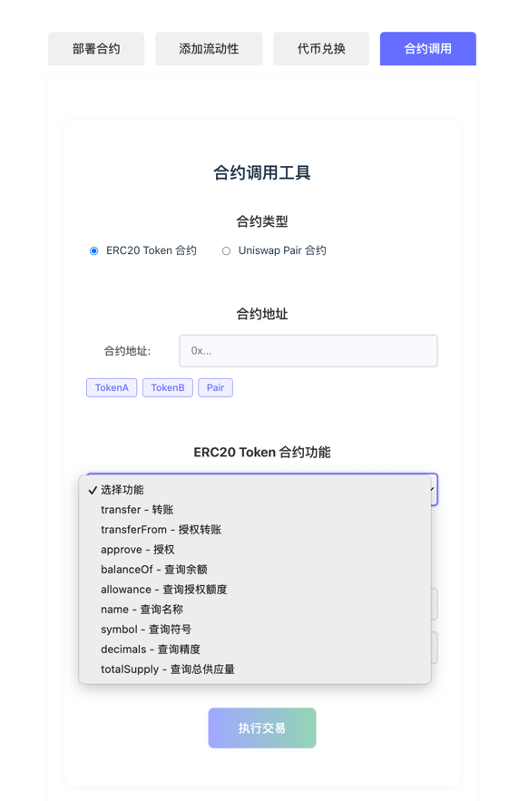
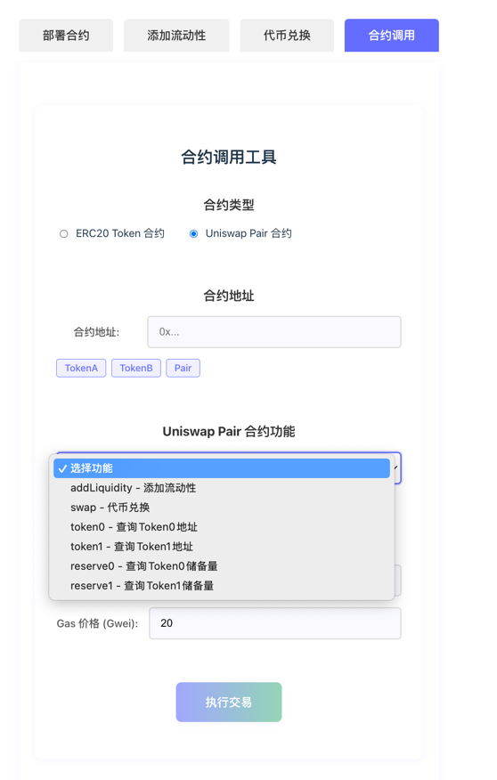

# Uniswap-lite DEX 项目说明文档
## 预览截图






## 1. 安装依赖
```bash
npm install
cd frontend-vue-old
npm install
```

## 2. 启动本地 Hardhat 节点
```bash
npx hardhat node
```

## 3. 部署合约
```bash
npx hardhat run scripts/deploy.js --network localhost
```

## 4. 启动前端
```bash
cd frontend-vue-old
npm run dev
```

## 5. 配置 MetaMask
- Chain ID: 31337
- RPC: http://localhost:8545

## 6. 使用流程
- 输入 Token A/B 数量添加流动性
- 输入 Token 数量进行 Swap


本项目为教学用，未做安全处理。
